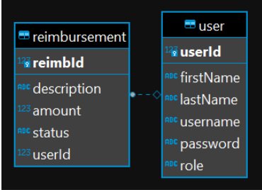

# Project 1

## Overview (Due: 01/03/24 Friday)

The goal of project 1 is to create a **Java Full Stack Employee Reimbursement System (ERS)**. The main use case of the ERS centers around Employees submitting Reimbursements that can either be accepted or denied by Managers. 

The tech stack will consist of a 

- React-Based Front end (talks to backend via HTTP)
- Spring-Based Back End
- The database will be either a local or cloud-based Postgres database. 

The entire application will have error handling in place to prevent the user from invoking unauthorized functionalities or entering invalid inputs.

## User Stories

- Create an account (create new User – default role should be employee)

- Create a new Reimbursement

- See all reimbursement tickets (only their own)

-  See only their pending reimbursement tickets

- [Some other functionality of your choice]

- OPTIONAL: Update the description of a pending reimbursement

## Manager User Stories
Managers using the application can:

See all reimbursements

- See all pending reimbursements

- Resolve a reimbursement

- (update status from PENDING to APPROVED or DENIED)

- See all Users

- Delete a User

-  (should also delete any related reimbursements)

- OPTIONAL: Update an employee’s role to manager

*Managers can do anything Users can do. No need for role checks on User functionalities.

## Not Logged Users
Users who are not logged in to the application can ONLY:

- Attempt to log in.

- Register for a new account (create new User)

Users should not be able to access the other user stories before logging in.

## Optional User Stories (Only try these after completing the stories above)

- Logging of the Service layer with logback.
- Test Suites for the Service layer with JUnit
- Log out

Both testing and logging will be required for P2, so this could be good practice!

## Database Architecture

Change table columns as you see fit, but keep in mind that the diagram shows the absolute minimum requirements.

- Add constraints to the tables as you see fit, and make sure to error handle for them!

Remember to consult the demos, your peers, and google 🎉 and Bao

# How are these graded?

- If you have all the functionalities working front-end to back-end that’s a blue

- If you have almost all of the functionalities (maybe missing 1), that’s green

- Missing about 25% of the stories brings you to lime

- If you have just a few working, that’s yellow territory

- Very little to nothing done is red